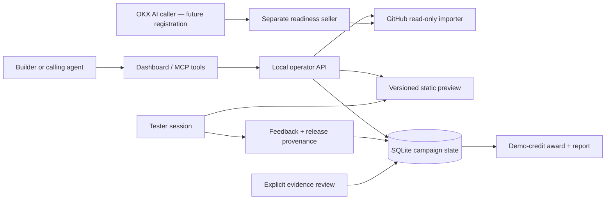

# Prototype architecture and product boundary

## Why this product

The initial buyer is a builder or agent operator who already has a project and wants to learn from a working version. The service being developed is the complete launch-and-learning loop: deployment preparation, version-specific test tasks, evidence collection, incentive settlement and iteration.

Existing deployment tools and paid-testing services cover important parts. In prior research, Sage already offered paid missions and feedback review and had an OKX AI listing. The proposed distinction is source-to-environment readiness and feedback that can be reproduced against the exact release, then used to drive a new version. That is a hypothesis to validate, not evidence of demand or a claim of novelty.

## Boundaries

- The operator server binds to `127.0.0.1`. It trusts the local machine's operator. It has Host checks and same-origin mutation checks, plus an optional bearer token for API clients. This is not multi-tenant authentication and must not be exposed through a public tunnel.
- Preview files use a separate origin and a sandbox CSP without `allow-same-origin`, with outbound requests blocked. The prototype executes no user repository code on the host. Do not relax this policy merely to make an unsupported application run.
- The seller endpoint is separate and only inspects public source. It cannot access local campaign records. Public hosting still needs HTTPS, request limits, observability and abuse controls.
- SQLite stores one versioned state document. `BEGIN IMMEDIATE` serializes state changes, and reservation plus ledger invariants are checked before commit. This is a small-prototype persistence strategy, not a scale architecture.
- A submitted session continues holding its reward after the 30-minute start window expires. Operator review must eventually resolve it. There is no automatic rejection or timeout forfeiture after valid submission.
- Every feedback record copies its release ID, source digest, Git commit if available, and preview URL. Later deployments do not rewrite it. Source code is not attached to public feedback reports.
- Feedback is self-reported. The caller or operator reviews evidence; no hidden LLM judgment claims to verify humanity. Unique aliases do not prevent Sybil attacks. There is no imported recruitment network.
- An accepted record awards demo credits once. There is no money custody, blockchain escrow, token issuance, insurance or financial return. Real rewards need their own funded settlement design.

## State transitions

Release: `preparing → ready | failed`.

Campaign: `open → closed`. Closing stops new reservations but preserves existing commitments.

Reservation: `reserved → submitted → accepted | rejected`; unsubmitted reservations can become `expired` after 30 minutes. Accepted sessions create one ledger entry. Rejection or expiry frees the reserved amount. A useful failed attempt is eligible for acceptance.

The UI shows the evidence available. Readiness means a compatible static package and reachable local entry point, not functional correctness of every asset, security of a contract, public uptime or production readiness.

## Missing capabilities

Public accounts and hosting, real human sourcing, wallet-bound identity, mainnet/testnet reward settlement, public paid-service verification with separate buyer/merchant accounts, arbitrary builds in isolated workers, smart-contract deployment/simulation, multi-chain support, background recovery jobs, retention and appeals policies, and automated patch/retest are future work.

The bounded local readiness API passed a real testnet self-payment on 22 September 2026, with the report delivered and the exact token transfer independently verified. This does not implement campaign reward settlement or an OKX AI listing. See the [payment evidence](../deploy/launchlab-seller-testnet-payment-evidence.json).

## Repository layout

- `src/domain.mjs`, `store.mjs`: campaign state and atomic accounting.
- `src/repos.mjs`, `services.mjs`: source import and versioned preview preparation.
- `src/http.mjs`, `server.mjs`: local operator and isolated preview servers.
- `src/mcp.mjs`: official SDK stdio MCP interface.
- `src/seller.mjs`: bounded OKX readiness API with optional official x402 middleware.
- `web/`: dashboard, tester journey and review interface.
- `examples/hello-xlayer/`: independent starter project.
- `test/`: behavioral integration tests.

## Managed deployment direction — 17 September 2026

The user selected one LaunchLab demo hosting account and subsequently chose AWS hosting. The [reusable managed pipeline](reusable-amplify-pipeline.md) now connects read-only inspection to per-project CodeBuild, Amplify and feedback resources for npm/Vite static frontends and plain static sites. It has its own persisted plan, bounded repair policy, bearer-protected API and four MCP tools. The optional [GPT validation agent](gpt-validation-agent.md) layers five more tools over this pipeline for source-aware measurement plans, fixed tracking insertions, custom feedback questions and evidence summaries. The model key remains in the local operator process. The broader [Vercel-backed design](managed-deployment-mvp.md) is historical research. The inspector itself still does not execute code, and the earlier local static adapter remains separate.
