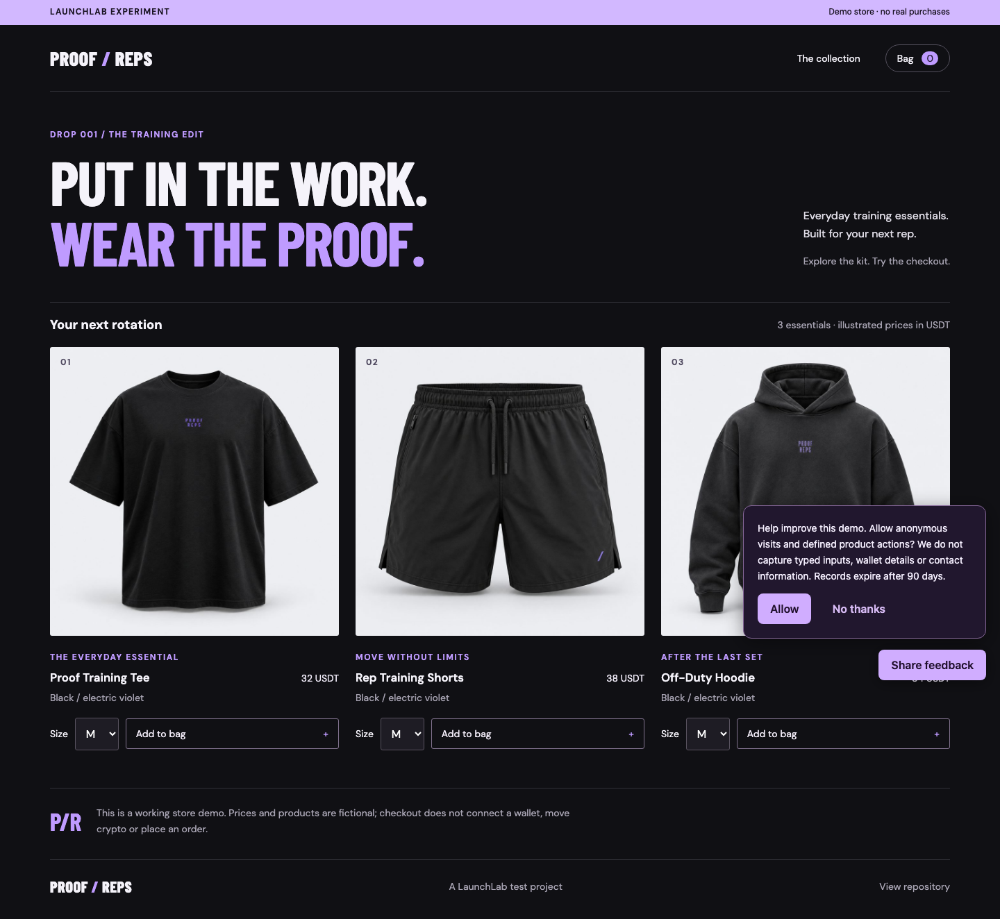
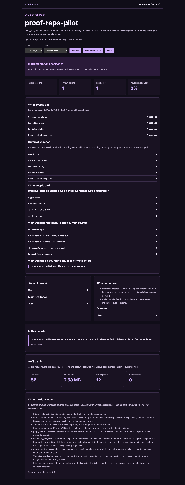

# PROOF / REPS hosted demo — 24 September 2026

The later [dashboard and counting update](dashboard-counting-update.md) adds sidebar
navigation and repeated-action counts on this same URL. The measurements below
describe the original step-1 verification; current totals include subsequent visits.

LaunchLab completed a real hosted journey from a public GitHub repository to a
GPT-instrumented Vite store, AWS deployment, opt-in activity and feedback, and an
evidence-based report returned to an external agent. This is hackathon step 1.
OKX AI publication and paid workflow integration remain the next stage.

## Open the demo

- [Source repository](https://github.com/JyTey2004/launchlab-proof-reps-public-demo)
- [Live store](https://preview.d2xy2zo7ya2zs2.amplifyapp.com/)
- [Founder results](https://preview.d2xy2zo7ya2zs2.amplifyapp.com/__launchlab/results.html)
- [Service health](https://launchlab-13-214-10-243.sslip.io/health)
- [Sanitized verification record](../deploy/hosted-proof-reps-evidence.json)

The store requires a preview login. Founder results additionally require a report
key. On the operator's machine, the private access sheet is
`.data/hosted-operator/step1/FOUNDER_ACCESS.md` inside this repository. It is ignored
by Git; do not include it in a submission, screenshots or recordings. Tester
invitations should contain only preview access, never the report key or service key.

## Walkthrough

1. Show the source repository. It contains the original static Vite storefront
   without LaunchLab tracking. The original private repository remains private.
2. Show the saved workflow plan. LaunchLab pinned commit
   `23eeae76ba6839f0b49ebf2b347796bc2b1f7ccc`, identified Vite and proposed four
   interaction hooks and three contextual questions. Edits apply only to the
   disposable build copy; LaunchLab did not push them to GitHub.
3. Show the approved deployment result. The isolated AWS build succeeded and
   published one Amplify job. The preview's 15 assets were verified, and anonymous
   preview/report access was denied.
4. Open the live store with `?test=1` during rehearsals. Tracking is initially off;
   selecting “No thanks” keeps it off. Opt in, open the collection, select a size,
   add an item, inspect the bag, and complete the simulated checkout. No money is
   transferred and no order is fulfilled.
5. Submit feedback. Mark rehearsal comments as internal testing. Submitting again
   in the same session updates the response without inflating the response count.
6. Open founder results and select **Internal tests**. The verified run has one
   opted-in session, one response and all five funnel steps recorded. The report
   says **Instrumentation check only**. Select **Organic visitors** to show the
   empty customer audience; at verification it had zero sessions and responses.
7. Show the external agent's report and analysis. Both are available through
   authenticated HTTPS and the MCP wrapper, without requiring the founder to use
   the dashboard. Internal QA analysis cites recorded evidence and returns no
   product recommendations. Unchanged evidence returns its cached analysis;
   an empty customer audience skips GPT entirely.

The dashboard refreshes while open. Agent clients explicitly poll status and read
reports; this demo does not claim automatic outbound notifications or autonomous
tester recruitment.

## Saved run

| Item | Value |
| --- | --- |
| Workflow | `wf_2a278987f6a8e6d72562`, revision 3 |
| Experiment | `exp_6e14da0a74a631193507` |
| Deployment | `dep_6e14da0a74a631193507` |
| AWS project | `llh-proof-reps-pilot-31193507` |
| Amplify | `d2xy2zo7ya2zs2`, branch `preview`, job `1` |
| Successful build | `llh-proof-reps-pilot-31193507:db95e661-b4c3-40ea-983d-491b3600080d` |
| Plan digest | `991aefe97e3b7e84bd061eb924398e1ee0dd5705183ccdf0583a33e32e0c17cf` |
| Instrumentation digest | `e83f280adabab59d1ef33e8822b4b47b52d9849d4a695ff35954e57a715881c5` |

The local operator's `.data/hosted-operator/founder-client.json` configures the
external MCP client. Use `launchlab_get_workflow`, `launchlab_workflow_report`,
`launchlab_analyze_workflow` and `launchlab_get_job` with this workflow ID. This
caller configuration contains a secret and must remain private.

## What was tested and fixed

Desktop and mobile browser checks verified the store, consent decline/accept,
simulated checkout, feedback resubmission, dashboard authentication and locking,
cohort separation and absence of horizontal overflow or JavaScript page errors.
The external MCP report matched the dashboard. Analysis returned its actual
findings, and retrying its idempotency key returned the same completed job.

Live testing exposed invalid GPT hook proposals, missing scoped AWS permissions,
browser preflight failures and an analysis result overwritten by deployment
status. These were fixed and released. The collector now also withholds product
recommendations for internal and agent activity. Regression verification passed
103 Node tests, 16 Python tests and syntax checks. This release was tested locally
and on the live service; no GitHub CI run is claimed for the current uncommitted
application changes.

Two rejected planning calls were retained before a revised planning attempt
succeeded. There were three planning calls total, one analysis call, one AWS build
and one Amplify publishing job. Two failed provisioning attempts were rolled back;
their retained bucket/table were checked empty before removal. Recovery reused
the existing successful build. The complete attempt history remains in the
verification record; this was not an unattended first-attempt success.

The pipeline's original HTTP verification recorded
`browserInteractionTested: false`. That historical field is preserved. The
separate browser evidence records the later successful interaction checks.

## Current limits

- One internal QA response proves the collection path works. It does not prove
  traction, payment preference, willingness to pay or product-market fit.
- The hosted flow supports public static/Vite repositories. Private repository
  authorization, server-rendered applications and user server secrets need more work.
- Checkout is simulated. This run did not register an OKX AI agent, charge an
  x402 payment, recruit users or pay incentives.
- Hosting remains active until explicitly removed. There is no automatic expiry
  or hard spending ceiling; base hosting, project usage and GPT/build charges are
  separate.
- Bootstrap found no matching LaunchLab Linear issue or issue-linked Notion spec.
  No canonical project status was changed to Done.

## Screenshots

Captured from the actual deployed preview and dashboard. All activity shown is
internal QA; no credentials are visible.

[Mobile store](evidence/hosted-proof-reps/store-mobile.png) ·
[Mobile report](evidence/hosted-proof-reps/report-mobile.png)
