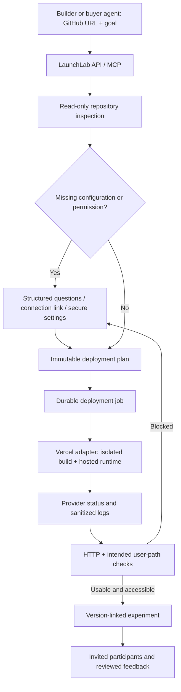

# GitHub link → hosted experiment: deployment MVP

Historical research and proposed architecture, 17 September 2026. As of 19 September, the user-selected AWS path is implemented for npm/Vite static frontends and plain static sites. See [the reusable Amplify pipeline](reusable-amplify-pipeline.md) for current behavior and live evidence. The Vercel-specific and broader runtime work described below remains a proposal. Website design is owned separately.

## Recommendation

Use Vercel as the first managed build/hosting provider. LaunchLab should own the conversation, pinned deployment plan, resumable operation, readiness evidence and experiment. Adopt the separation between inspection, building and serving without building a cloud platform during the hackathon.

The live demonstration should accept an ordinary supported GitHub repository, ask for access and missing information, produce a real HTTPS deployment, verify the intended user path, and connect the result to an experiment. A LaunchLab-specific manifest should become optional metadata for mission and health-check hints, rather than the entry requirement for inspecting ordinary web projects.

Confirmed operational model: the user selected **one LaunchLab demo hosting account** on 17 September 2026. Start with a small set of explicitly authorized demo repositories. Connect the hosting account once; builders grant repository access and provide project-specific settings. No account or paid resource was created during this research.

## What the Vercel documentation establishes

Vercel detects common frameworks and uses isolated build environments. Build output is separated from the build process. Its documented output format represents static assets, functions and routing; static assets are served through its CDN. This explains the scalable architecture at a useful public-documentation level, without claiming knowledge of proprietary internals. [Builds](https://vercel.com/docs/builds), [Build Output API](https://vercel.com/docs/build-output-api), [output primitives](https://vercel.com/docs/build-output-api/primitives).

Deployments can be created programmatically and their state polled. Git source and uploaded files are alternative submission paths. The API's `gitAccessToken` field is explicitly restricted to Vercel platform accounts, so a normal account must not assume it can pass any customer's GitHub token to that endpoint. [Create deployment API](https://vercel.com/docs/rest-api/deployments/create-a-new-deployment).

A commit-specific deployment URL identifies a particular version; branch URLs move with later deployments. Retention and access settings still affect availability. Our evidence should store the deployment ID and version URL. [Generated URLs](https://vercel.com/docs/deployments/generated-urls).

Repository access and hosting authorization are separate. GitHub Apps can receive access to selected repositories and bounded installation tokens. Native Vercel Git deployments also require the applicable Vercel/GitHub connection and permissions. [GitHub App permissions](https://docs.github.com/en/apps/creating-github-apps/registering-a-github-app/choosing-permissions-for-a-github-app), [installation tokens](https://docs.github.com/en/rest/apps/apps#create-an-installation-access-token-for-an-app), [Vercel GitHub integration](https://vercel.com/docs/git/vercel-for-github).

Deployment protection can prevent testers from reaching a successfully built app. A ready build alone is therefore insufficient for opening a mission. Verify access as the intended tester and preserve the access policy rather than automatically disabling protection. [Deployment protection](https://vercel.com/docs/deployment-protection).

## Architecture we should build

| Component          | Responsibility                                                                                                                                  |
| ------------------ | ----------------------------------------------------------------------------------------------------------------------------------------------- |
| GitHub connection  | Verify repository-specific read permission, resolve the selected ref and pin a commit.                                                          |
| Inspector          | Identify likely framework, application directory, package manager and missing configuration; never execute repo code on the operator host.      |
| Calling agent      | Explain findings, ask focused questions and propose choices within the user's goal. Treat repository instructions and logs as untrusted data.   |
| Deployment planner | Record commit, root, provider/account, build settings, required secret references, visibility, lifetime, check criteria and permitted spending. |
| Durable worker     | Submit or reconcile a provider operation, persist its ID, poll or consume verified webhooks, and resume after interruption.                     |
| Vercel adapter     | Create a separate project for the application, configure approved values, submit the pinned source and return actual deployment state.          |
| Readiness checks   | Distinguish build succeeded, URL reachable and mission usable. Check tester access and external dependencies.                                   |
| Experiment service | Reuse LaunchLab's campaign, feedback provenance and review accounting after the release passes the agreed checks.                               |

One provider project per application gives clear settings and environment separation. Each version gets its own deployment record. It is not a claim of full tenant isolation by itself. LaunchLab's management credentials must never be exposed to deployed project builds.

A long-running deployment worker should be independent of the requesting HTTP connection. Reuse our SQLite-backed run model for the local pilot, add persistent deployment jobs and provider IDs, then move to a suitable shared database/queue when deploying the management service publicly. Do not place the current local SQLite operator unchanged into an ephemeral function or expose it through a tunnel.

## Intended user and agent experience

1. Paste a GitHub URL and say what should be live and what to learn. For an example: “Deploy this X Layer transaction explainer so three developers can try its API.”
2. Connect the required account once. A public repository may be inspectable without GitHub auth, but that does not authorize hosting spend or prove ownership.
3. Inspect the pinned source. Infer straightforward settings; group unresolved items in one short request.
4. Return a plan with the exact version, supported runtime, preview visibility, missing services, expected build method and hosting allowance. Check existing authorization before asking for any additional confirmation.
5. Submit the build and show durable progress. On missing configuration, pause with a specific request; on code failure, show a proposed fix or useful log excerpt. Do not silently rewrite the repository or substitute an invented successful deployment.
6. Return an HTTPS URL plus check evidence. If the application passes its intended test path, open the agreed experiment. If only deployment works, label the remaining application blocker.
7. Tie feedback to that deployment. A later fix creates another version and a comparable retest.

Example questions should be concrete:

- “This repo contains `apps/web` and `apps/worker`. Which one should be deployed?”
- “The preview needs `POSTGRES_URL`. Connect a test database or select an existing test connection.”
- “Which X Layer network and deployed contract address should this version use?”
- “GitHub OAuth needs a callback for this preview. Use the configured test OAuth app?”

Secrets go through a secure configuration form or provider connection. The agent receives variable names and readiness status, never raw passwords, keys or tokens. A supplied environment value can still be exposed by application code or public client-variable conventions; do not claim that the provider alone prevents this.

## Two viable source-delivery paths

**First demonstration:** connect the intended demo repository through Vercel's normal GitHub integration and submit a pinned Git deployment. This minimizes custom source transfer and allows a real build to be demonstrated early. Private-repository permission and account eligibility must be verified in the actual account.

**Later customer repositories:** either authorize both GitHub and the customer's Vercel connection, or read an authorized pinned snapshot and submit bounded files through Vercel's file-upload deployment API. The latter requires a tested file-selection policy, exclusion of credentials, handling of symlinks/LFS/submodules and provenance. It is not implemented by our current static importer. A GitHub App connection alone does not magically authorize Vercel's native Git import.

## Initial supported scope

Start with Next.js, Vite and plain static projects, plus a small HTTP API packaged in a supported Next.js application. Runtime, framework-version and dependency compatibility are checked for the selected project; this is not an “any repo” promise. Our MVP policy should defer custom persistent workers, container stacks, databases and smart-contract deployment to explicit adapters or connected services.

For the demo, use a small X Layer transaction-explainer application with a web page and an API route. Read-only RPC access makes the first deployment easier to verify than wallet signing or contract deployment. Show one useful missing-setting request, a real build, the actual endpoint response and a participant-facing mission. A second independent repository should exercise the same path to show that the deployment is not hardcoded.

## Agent request/response contract to add

Proposed long-running methods: `prepare_deployment`, `answer_deployment_questions`, `start_deployment`, `get_deployment` and `cancel_deployment`. These are design names, not tools that already exist.

Persist `requestId`, exact commit, configuration revision, plan digest, questions and answers, connection/secret references, provider project/deployment IDs, intended visibility, check evidence and terminal result. Every question has an ID, reason, answer type and resolving condition. Answers continue the same request; they must not create a duplicate provider operation.

Proposed states: `inspecting → needs_input | needs_connection → planned → queued → building → checking → ready | blocked | failed`. `unknown_provider_outcome` handles a request whose network response was lost. Reconcile before retrying a potentially billable deployment. The existing local run's retry mechanism cannot by itself guarantee exactly-once external API effects.

Provider-ready and experiment-ready are separate facts. Starting a campaign must require the agreed readiness evidence, not just a deployment URL.

## What was implemented in this turn

- `POST /api/deployments/inspect` and MCP `launchlab_inspect_deployment`.
- Ordinary GitHub repository inspection without requiring `launchlab.json`.
- Pinned commit/tree, candidate Next.js/Vite/static detection, monorepo folder question, lockfile inspection and environment **name** discovery from `.env.example` / `.env.sample`.
- Connection questions for inaccessible repositories, bounded reads and explicit unsupported/incomplete results. No code execution, project creation, build or deployment.
- Optional operator-configured `LAUNCHLAB_GITHUB_TOKEN` for authorized private reads. A browser GitHub App flow is not implemented, and API requests reject raw tokens and environment values.

Call with `{ "repoUrl": "https://github.com/owner/repo" }`. To resolve a monorepo question, call again with `rootDirectory` and the returned commit SHA as `ref`. Other returned questions are inputs to the planned deployment coordinator; it does not yet persist or resolve them. `inspection_complete` means inspection finished, not that a project was built or is ready to deploy.

Live read-only inspection of [Vercel's public starter](https://github.com/vercel/nextjs-postgres-nextauth-tailwindcss-template) at commit `fe026711c19ac3ee4589c86a738f59b84e611559` detected Next.js, pnpm and five environment names including `POSTGRES_URL` and authentication configuration. It returned a configuration question instead of claiming a runnable deployment. No secret values were returned and no build was initiated.

Verification: JavaScript syntax checks and 37 tests passed, including eight inspection tests and the existing deployment/campaign/MCP suite. A final targeted test covers database hints from environment names as well as dependencies.

## Remaining delivery sequence

1. Establish the actual hosting account connection and repository access for the selected demo.
2. Add the Vercel adapter and persistent provider job/reconciliation records; exercise one real hosted deployment.
3. Add structured answer/resume and secure settings, keeping secrets outside agent messages and run records.
4. Add HTTP/user-path checks and connect a verified hosted release to the existing experiment service.
5. Add authenticated public builder/tester access and run the workflow through an actual OKX service integration.
6. Demonstrate real invited feedback. Keep recruitment and real reward settlement explicit separate integrations.

For the first hosted test, missing prerequisites are account authorization, selected repository permission, preview access policy and any required test credentials. An absence of those prerequisites does not prevent implementing and testing the adapter with mocks, but it does prevent honestly claiming a live deployment.
