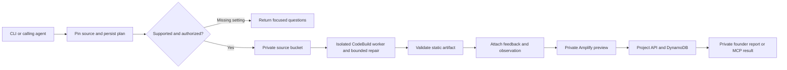

# Reusable GitHub → Amplify pipeline

Implemented and exercised on 19 September 2026. This is the current managed-hosting path. It supersedes the Vercel-first proposal in `managed-deployment-mvp.md` for the supported static frontend scope.

Give LaunchLab a GitHub repository, an experiment hypothesis and a stable request key. It pins a commit, checks compatibility, builds in AWS CodeBuild, publishes a separate password-protected Amplify preview, attaches opt-in observation and feedback, and returns the website and private results links. The calling agent can use four MCP tools; the operator can use the CLI.

## Verified example

| Evidence | Result |
| --- | --- |
| Private source repository | [launchlab-event-pass-demo](https://github.com/JyTey2004/launchlab-event-pass-demo) |
| Pinned source | `ada5409b55b8893f4a84a6761901e813b90ec398` |
| Preview | [NIGHT PASS](https://preview.du18ezoxh0r24.amplifyapp.com) |
| Founder results | [Private results page](https://preview.du18ezoxh0r24.amplifyapp.com/__launchlab/results.html) |
| Deployment | `dep_fe142ceeff55d349c06f` |
| AWS stack / build project | `ll-night-pass-d349c06f` |
| Amplify app / job | `du18ezoxh0r24` / `1` |
| CodeBuild execution | `ll-night-pass-d349c06f:32d30609-b9f1-42ad-bfe0-97968f727f19` |
| Build repairs | Added `vite build`, updated Vite `8.0.0 → 8.3.0`, generated npm lockfile |
| Hosted artifact check | All 9 files matched local bytes; preview and results API reject anonymous access |
| Feedback verification | 1 internal QA session, primary action and feedback response; retry counted once |
| Organic evidence | 0 sessions and 0 responses at verification; no demand claim |
| Repeat request | Reused the ready environment; still one CodeBuild execution and one Amplify job |
| Agent interface | Live MCP plan → start → poll → report passed against the running operator API |

The original PROOF / REPS preview remained available. Its report key was rejected by the new project's API. The second repository's main commit remained unchanged after repairs.

Preview login and the separate founder report key are stored only in `.data/managed/dep_fe142ceeff55d349c06f/founder-access.json` with file mode 0600. Open that local file to obtain access; never put its contents in Git, an agent prompt or a public report. Non-secret evidence is in [`deploy/managed-night-pass-evidence.json`](../deploy/managed-night-pass-evidence.json).

## Run another repository

Requires Node 22.13+, Python 3, GitHub CLI and AWS CLI. Authenticate GitHub and the configured AWS profile outside the agent conversation. `LAUNCHLAB_GITHUB_TOKEN`, if privately configured, overrides the existing `gh` login. The AWS account is checked against `deploy/managed-hosting.json` before mutations.

```sh
# Inspect and persist the plan. No AWS resources are created.
npm run deploy:repo -- https://github.com/OWNER/REPO \
  --name my-experiment --request-key my-experiment-001 \
  --hypothesis 'Will intended users try this product?' \
  --repair --refresh-build-packages

# With authorization for the returned scope, repeat with --execute.
npm run deploy:repo -- https://github.com/OWNER/REPO \
  --name my-experiment --request-key my-experiment-001 \
  --hypothesis 'Will intended users try this product?' \
  --repair --refresh-build-packages --execute

npm run deploy:repo -- --status DEPLOYMENT_ID
npm run deploy:repo -- --report DEPLOYMENT_ID
```

Optional settings: `--ref COMMIT_OR_REF`, `--root apps/web`, `--output dist`, `--node 22` or `24`, and `--goal-event try_demo`. The first plan pins the ref; reuse of its request key does not silently move to a newer commit. A different brief, source revision or repair policy requires a new request key and creates another environment. This version does not update an existing project's stable URL.

No lockfile or missing Vite build command requires `--repair`. Package refresh additionally requires `--refresh-build-packages`. Both are off by default. A plan with `needs_input` returns questions and creates no cloud resources. Resolve the repository/settings and plan with a new key; there is no interactive answer-editing endpoint yet.

## Agent workflow

Start the loopback operator with `LAUNCHLAB_MANAGED_ENABLED=true` and a privately generated `LAUNCHLAB_API_TOKEN`. A local ignored `.env` was configured for this demo. `npm start` reads it; the API listens at `http://127.0.0.1:4310`.

Configure an MCP client to run `node --env-file=/absolute/path/okx-launch-lab/.env /absolute/path/okx-launch-lab/src/mcp.mjs`. Keep the env file local; its contents must not enter prompts or client configuration committed to Git.

1. `launchlab_plan_deployment`: supply `repoUrl`, `name`, `requestKey`, `hypothesis`, optional build settings and explicit repair flags.
2. Check `questions`, source revision, visibility, hosting cost scope and repair policy. Match the plan against the builder's existing authorization; request further approval only if scope exceeds it.
3. `launchlab_start_deployment`: send `deploymentId` and the exact `planDigest`. Returns immediately while a detached local worker runs.
4. `launchlab_get_deployment`: poll progress and blockers, then obtain verified links and the local access-file path.
5. `launchlab_deployment_report`: read `organic`, `incentivized`, `agent` or `test` results for 7 or 30 days. The service uses the private report credential internally.

Example instruction:

> Deploy this GitHub repository as a private LaunchLab experiment. Test whether users click “Try the pass.” Use our configured demo hosting account. Allow missing Vite build-command and lockfile repairs, plus stable same-major build-package updates. Return the preview, repair evidence and private report location. Keep test activity separate from organic results.

HTTP equivalents, all requiring the operator bearer token:

| Method | Route | Behavior |
| --- | --- | --- |
| POST | `/api/managed-deployments` | Plan and return questions/digest |
| GET | `/api/managed-deployments` | List operator deployments |
| POST | `/api/managed-deployments/:id/start` | Start with `{ "planDigest": "..." }`; returns 202 |
| GET | `/api/managed-deployments/:id` | Read persisted progress and evidence |
| GET | `/api/managed-deployments/:id/report?cohort=organic&days=7` | Read scoped results |

The web workspace's earlier local-demo flow is separate. This managed path is currently accessed through CLI, HTTP or MCP. It is not registered on OKX AI and does not yet charge a marketplace buyer or settle x402 payments.

## Build repair policy

The build doctor is a deterministic rule engine, not an embedded GPT agent. A connected LLM agent can call the deployment tools, interpret blockers and propose broader fixes; the cloud worker itself applies only these pre-authorized changes:

- Add `vite build` when Vite is present and the build script is absent.
- Generate an npm lockfile when absent.
- Optionally refresh direct `vite`, `@vitejs/plugin-react`, `@vitejs/plugin-vue` and `typescript` dependencies to stable versions within their declared major. Downgrades, prereleases and ambiguous version specifications are excluded.

Repairs happen in the disposable build copy. `artifact/evidence/package.patch`, `package-lock.json` and `build-report.json` record the result. Regenerating the lockfile can also change transitive dependencies; the complete resolved lockfile is retained. Nothing is committed or pushed back to GitHub. There is one build attempt, limited to ten minutes. A failed build returns a blocker and its private CodeBuild log, rather than an arbitrary retry/patch loop.

Add framework support by extending `contracts.mjs` with a deliberate compatibility rule and adding a worker/provider adapter plus a real example deployment. A package upgrade alone does not make SSR, databases or another package manager supported.

## Architecture and limits



Each request owns its stack, Amplify app, S3 build bucket, build role, Lambda collector, table, session secret and report key. Build workers can access their own build bucket and logs, not the operator's GitHub credentials, Amplify management permissions or feedback table. Repository scripts never run on the operator host. Build artifacts are treated as untrusted; traversal, symlinks, unsupported public files and collisions with `__launchlab` are rejected before upload.

Supported now: npm-based static Vite frontends and plain static sites. Choose an application subdirectory only when it has a standalone dependency setup. Blocked: Next.js/SSR, runtime services, declared environment variables, conflicting/non-npm lockfiles and ancestor workspace dependencies. Hidden source files and credential-like extensions are excluded. Complex routing, external script/network requirements, custom runtime configuration and full application behavior need an adapter or additional checks; an HTTPS asset check does not establish browser usability. Browser interaction was not tested in this run.

CodeBuild uses a small Linux worker, one concurrent build per project, a ten-minute build timeout and five-minute queue timeout. Source/output limits are 30 MB, with at most 2,500 output files. The local configuration limits resources-backed managed deployments to five, but it is not a distributed quota or hard spending cap. Concurrent admission, public tenants, GitHub App installation, cancellation, webhooks, durable cloud queues and automatic expiry remain future work.

This is a single-operator pilot. Do not expose the loopback management API publicly as a multi-user service. No per-customer identity/ownership or tenant authorization layer is implemented. Hosting continues and incurs AWS usage until explicitly removed. No end-user subscription, real tester incentive or automatic recruitment is implemented.

## Observation and feedback

LaunchLab attaches its widget after the build. The main action is measured only if the application marks a control, for example:

```html
<button data-launchlab-event="try_demo">Try the pass</button>
```

Set the matching `goalEvent` in the plan. `goalMarkerFound` is a source-string check, not a browser test. Missing markers do not produce invented conversion counts; the site still gets voluntary feedback and opted-in page views.

Tracking is optional; feedback can be submitted without tracking consent. Records expire after 90 days. One response per session is updated on retry. Organic, incentivized, agent and test labels are reported separately; they are self-reported, not identity verification. Use `?test=1` for internal QA, `?actor=agent` for agents, or `?source=incentivized` for invited reward participants. No payout occurs through this form.

The report combines observed primary actions, stated intent, blockers and comments. Its suggested next experiment is rule-based. Primary actions are not sales, sessions are not unique people, and a small response count is not market validation. AWS request metrics include assets, bots and authentication errors. The report page refreshes while open; this is not an always-on alerting service.

## Operations and verification

```sh
npm run check
npm test
# Creates explicitly labelled internal QA feedback, then verifies retries and reports.
node scripts/verify-managed.mjs DEPLOYMENT_ID --test-feedback
```

Verification at implementation: 59 Node tests pass, including an invoked Python suite of 6 collector/archive tests. Live verification checked all nine hosted files, private access, project-specific keys, feedback readback, duplicate feedback handling, request reuse and the actual MCP API. Original PROOF / REPS availability was checked separately.

Run state, access files and evidence live in `.data/managed/:id/`. Keep that private state backed up if environments are retained. Repeating a ready request creates no cloud work. `--resume ID` continues the saved authorized request after an infrastructure interruption; a live worker lock prevents concurrent execution on one machine. A failed source build is not retried automatically. Lost responses during Amplify create/upload/start are not fully reconciled: inspect the existing app/job before resuming; the pipeline must not create a replacement project blindly.

CloudFormation rollback is surfaced for operator inspection. The pipeline does not delete failed or existing environments automatically. For an explicitly approved teardown, inspect `run.resources`, remove that stack, then handle its retained table and build bucket deliberately. S3 objects expire after seven days; feedback records have a 90-day TTL. Resource deletion, data deletion and hosting shutdown are separate actions; the current CLI has no cleanup command.

Core implementation remains in the local checkout alongside pre-existing uncommitted work. The second example repo is committed and pushed; AWS build/deployment evidence is live. No matching LaunchLab issue/spec was found in the Stardive project bootstrap, so no unrelated Linear delivery state was changed.
