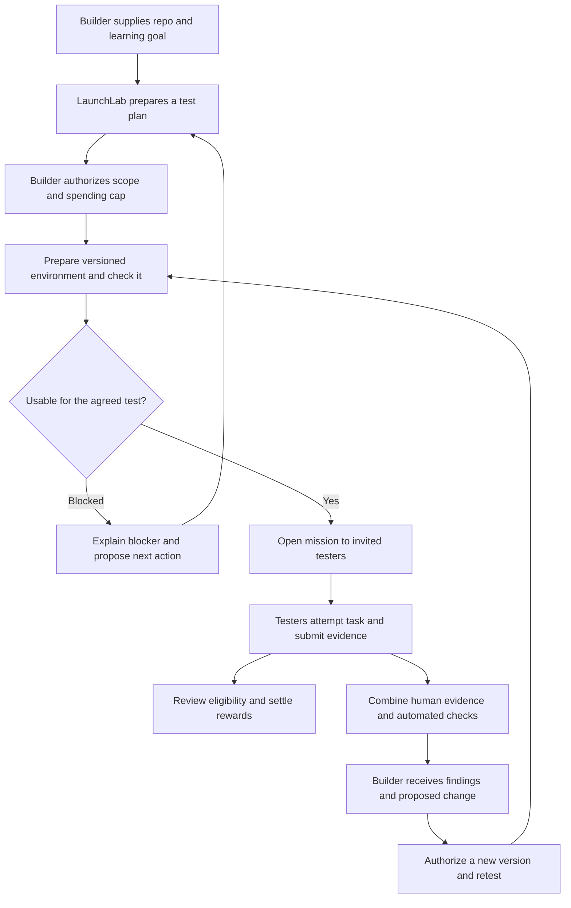

# LaunchLab user journey and experience — proposal

Journey proposal, 17 September 2026. The user has resumed core product implementation and delegated website design separately. The persistent local run backend now implements planning, scope confirmation, preview/campaign preparation and evidence retrieval; see [the tested API contract](run-api.md). The broader journey below remains a proposal unless explicitly covered by that contract. Public deployment, real tester recruitment and settlement are not implemented.

## 1. Product promise and first customer

**“Give us your repo and a question. Get a working test environment, relevant people trying it, and evidence of what to improve.”**

Working audience assumption: developers shipping agents, APIs and tools for OKX AI / X Layer. The audience question is still open. Consumer dApps can share this core journey, but require different deployment adapters and test missions.

The builder is the paying customer. Their agent can commission and manage the work. Human testers participate in exchange for an agreed reward. LaunchLab operates the environment, coordinates the test and preserves the evidence. This is a developer service with a separate participant experience.

The first outcome is learning from a usable release. A successful test may uncover a serious problem. Paying people to participate does not establish organic demand or willingness to pay for the product under test.

## 2. The example that guides the design

Proposed example, not a selected or implemented demo: an **X Layer transaction explainer**. Another agent provides a transaction hash and receives a structured explanation of what happened.

Builder request:

> “Test this repo with three developers who have never used it. Can their agents call it successfully, and can they understand its answer? Prepare a test environment and stay within the budget I approve.”

The test has two distinct evidence streams:

| Stream              | Question                                                                                              | Evidence                                                                                    |
| ------------------- | ----------------------------------------------------------------------------------------------------- | ------------------------------------------------------------------------------------------- |
| Agent compatibility | Can a client discover the capability, form a valid request, handle an error and consume the response? | Actual requests, responses, schema checks, duration and payment receipts where applicable.  |
| Human usefulness    | Can a first-time developer complete the task and explain the result?                                  | Attempt, observed outcome, confusion, reproduction steps and optional consented screenshot. |

Known transaction fixtures can check specific output facts. Passing a schema check alone says nothing about those facts. A client-agent run must be labeled automated and never counted as a human participant.

Suggested mission: “Use the service to explain the supplied transaction. Identify what moved, whether the transaction succeeded and what you would tell your user. Show the response and any step that prevented you from answering.”

The demo's payoff is a visible chain: **release → observed problem → proposed change → new release → retest**. Any staged feedback must be labeled as a demo fixture. A real participant's observation remains in their own words alongside the agent's interpretation.

## 3. One run, two entry points

Live marketplace inspection on 17 September found that Use now opens instructions to copy a service-selection prompt into the user's own agent. The four listings inspected did not expose an inline task form. See [OKX buyer UX research and website plan](okx-buyer-ux-research.md) for observed steps, documentation boundaries and the proposed capabilities homepage. Our website should prepare a complete brief and make this handoff explicit. A direct website-to-OKX task integration is not yet verified.

In the proposed experience, the builder can start from their agent or prepare a brief on the LaunchLab website. Once the service accepts the request, both paths should resolve to the same run ID and progress link. Switching between them must preserve scope, permissions and spending limits. Preparing or copying a brief alone does not create a run.

A run has a learning goal, pinned source version, environment, mission, audience, budget, evidence and result. A project can contain several runs. This is the user's primary unit of work; they should not need to assemble separate project, release, campaign and feedback records themselves.

## 4. Builder journey

| Stage       | Builder sees and does                                                                                                                           | LaunchLab does                                                                                     | Exit condition                                                                  |
| ----------- | ----------------------------------------------------------------------------------------------------------------------------------------------- | -------------------------------------------------------------------------------------------------- | ------------------------------------------------------------------------------- |
| Start       | Paste a repo or use the example; state “What do you want to learn?”                                                                             | Inspect supported project metadata and propose a testable question.                                | Repo and objective are understood, or a specific incompatibility is explained.  |
| Review plan | Review the task, audience, participant count, environment visibility and lifetime, deliverables, costs and permissions. Edit only what matters. | Draft a mission and quote, identify prerequisites, distinguish confirmed checks from unknowns.     | Builder authorizes a concrete scope and maximum spend.                          |
| Prepare     | See named steps, a preview or sample call, blockers and the next required action.                                                               | Pin source, prepare the environment and exercise the agreed path.                                  | The exact version is usable for the mission.                                    |
| Run test    | See recruitment and actual attempts: invited, reserved, submitted and reviewed. Pause new sessions if needed.                                   | Keep the environment available, reserve rewards, collect evidence and run agreed automated checks. | Agreed coverage is reached or the deadline produces an explicit partial result. |
| Learn       | Read findings linked to original attempts and calls; inspect uncertain or conflicting observations.                                             | Group observations, distinguish facts from hypotheses and propose the smallest useful change.      | Builder can explain what to fix and why.                                        |
| Iterate     | Review a proposed patch or export a fix brief; authorize a new release and retest.                                                              | Preserve the earlier evidence and compare the new run using a comparable task and cohort.          | A finding is reproduced, resolved or remains uncertain.                         |

### Before the first commitment

The plan should answer these questions in one place:

- What will be tested, and what counts as an eligible attempt?
- Who will try it, and how will they be recruited?
- Which repo version, hosting capability and network will be used?
- Who can access the preview, and when will it expire?
- What is the service fee, reward pool and capped infrastructure/third-party allowance?
- What happens if deployment fails, fewer people participate, or the builder cancels?

Price components must reconcile to the maximum total. No invented quoted price is set by this plan. Demo credits, testnet tokens and real-money prices must always use distinct labels.

A compact read-only compatibility check may precede the quote. A separately paid diagnostic needs its own stated deliverable and price. Public deployment, paid calls and recruitment begin only within the accepted scope. Additional scope requires a revised authorization; routine actions within the existing allowance do not prompt repeatedly.

## 5. Tester journey

Testers enter through a mission link. They see the task, approximate effort, eligibility, reward, review deadline, data collection and environment type before joining. The page uses language appropriate to the mission: developers see a callable service; consumer testers see a usable application.

1. **Understand the mission.** Read a brief scenario and the evidence required. State clearly that useful reports of failure qualify for rewards.
2. **Reserve a place.** Authenticate, check eligibility and reserve the displayed reward. Show the reservation deadline and provide recovery if the platform interrupts the session.
3. **Try the product.** Open the release or use a sample client. Keep instructions accessible without covering the product. For discovery tests, avoid giving the exact sequence the test is meant to evaluate.
4. **Describe the attempt.** Ask “What did you try?”, “What happened?” and “Where did you get stuck?” Attach the version and session automatically. Let the tester review and redact captured evidence before submission.
5. **Track the result.** Confirm receipt, amount reserved and review due time. Show accepted, clarification needed, disputed and payout states with a clear next action.

A tester should be able to read mission details before connecting a wallet. Request wallet access only when the tested task or reward method requires it. Identity and eligibility checks must happen before reserving a scarce paid place; a wallet address or alias alone does not prove a unique person.

The mission must work on the participant's device. If a developer task needs a desktop or local client, state this before reservation. Wallet actions must identify the network, action and maximum exposure in readable terms. Never request seed phrases or private keys.

## 6. Rewards and fair review

Reward eligibility depends on an honest, relevant attempt and the evidence agreed before the session. It cannot depend on a favorable rating or a successful product outcome.

- Reserve the reward when a tester starts; keep it reserved after valid submission while review is pending.
- Use explicit, versioned eligibility rules. Do not change them after participation starts.
- Let an agent check completeness and flag suspicious patterns. A flag is evidence for review, not proof of fraud.
- The builder can comment on findings and dispute evidence. The builder must not be the sole authority able to deny payment because the feedback is negative.
- For the pilot, the LaunchLab operator handles ambiguous eligibility and appeals. The actual review deadline and appeal window must be staffed and agreed before any paid mission opens.
- Separate “feedback accepted” from “reward paid.” Payment confirmation requires a real receipt. An uncertain payment is reconciled before retrying.
- Closing a run stops new reservations while preserving existing obligations. Available, reserved, awarded and returnable balances remain visible.
- Show cancellation and partial-delivery terms before funding. Do not promise immediate refunds before a settlement implementation supports them.

The reward pool is distinct from the fee paid to LaunchLab. A paid API call does not itself fund or settle participant rewards.

## 7. What the agent controls

| Can operate within the accepted plan                                                                            | Requires a builder decision or a pre-existing explicit policy                                                   |
| --------------------------------------------------------------------------------------------------------------- | --------------------------------------------------------------------------------------------------------------- |
| Inspect supported source, prepare the agreed environment, run checks, propose a mission and summarize evidence. | Widen repo permissions, publish a private source or environment, change the network, or expand data collection. |
| Invite the approved cohort through the approved channel, collect attempts and issue permitted status updates.   | Purchase a new recruitment source or contact people outside that authorization.                                 |
| Use approved third-party services within the cost ceiling.                                                      | Exceed the cap, add another paid service or extend paid hosting.                                                |
| Propose fixes and prepare an isolated candidate version when authorized.                                        | Merge, release or promote that candidate beyond the agreed test scope.                                          |

Agent behavior should be visible through completed actions and evidence, not a stream of invented thinking. Show “Waiting for participants” when that is the real state. Every recovery action must resume the existing run without duplicating deployments, charges or payouts.

## 8. Minimum interface

Builder navigation: **Runs**, with project/version details inside a run and account/billing settings secondary. Returning builders land on their current run and the next meaningful action. First-time builders see the start form and a sample result.

| Surface                      | Main question                                                      | Primary action                                                |
| ---------------------------- | ------------------------------------------------------------------ | ------------------------------------------------------------- |
| Start a test                 | What do I want to learn from this repo?                            | Prepare test plan                                             |
| Plan and budget              | What will happen, what can it cost, and what am I authorizing?     | Authorize test                                                |
| Run workspace                | What happened, what is blocked, and what needs me?                 | Contextual: resolve blocker, invite testers, or view findings |
| Findings and retest          | What did we learn from this release, and what changes next?        | Review fix brief / start retest                               |
| Tester mission               | Is this relevant to me, and what does an eligible attempt involve? | Reserve and start                                             |
| Tester submission and reward | Was my evidence received, and what happens to my reward?           | Submit evidence / resolve clarification                       |

Operator review is a separate restricted surface. Builder, tester and operator controls must not share one unrestricted public dashboard.

Use progressive disclosure: show the plain-language outcome first, with commit, digest, protocol trace and payment receipt available in details. Show factual readiness checks with scope and timestamp; avoid an unexplained “launch score.” An environment being reachable is narrower than the product being production-ready.

Preserve drafts and session progress across refreshes. Make deadlines explicit with a timezone and remaining time. Use keyboard-accessible controls, labeled validation, readable mobile layouts and statuses expressed in text as well as color. Notify users for required action, material failure or completed findings, with preferences for routine progress.

## 9. Empty, waiting and failure states

| Situation                        | Useful experience                                                                                                                                                    |
| -------------------------------- | -------------------------------------------------------------------------------------------------------------------------------------------------------------------- |
| Unsupported repository           | Explain the unsupported capability and accepted formats before charging for deployment. Offer the included example or a specific preparation step.                   |
| Deployment or health check fails | Preserve the run, identify the failing step and offer retry after correction. Recruitment stays closed.                                                              |
| No testers have joined           | Show actual invitations and zero reservations. Offer extending the window, inviting another approved cohort, or ending with a partial result under the agreed terms. |
| Product breaks during a session  | Let the tester report a blocker. Preserve evidence and reward eligibility; pause new starts if the mission can no longer be attempted meaningfully.                  |
| Participant drops out            | Release an unsubmitted reservation after the disclosed deadline; preserve drafts and explain rejoining rules.                                                        |
| Review is overdue                | Keep funds reserved and escalate to the operator. Do not silently forfeit the reward.                                                                                |
| Payment response is uncertain    | Show pending confirmation, preserve the payment reference and reconcile before retry.                                                                                |
| Preview reaches expiry           | Stop new sessions, preserve reports and show an explicitly priced extension path. Do not promise indefinite hosting.                                                 |
| New source version arrives       | Keep existing evidence pinned. Create a new release and comparable retest.                                                                                           |

## 10. OKX AI and X Layer fit

The proposed primary service is a commissioned launch-and-test job with a defined report as its deliverable. The long-running journey fits the documented [OKX A2A per-task service model](https://web3.okx.com/onchainos/dev-docs/okxai/a2a-no-subscription): quote, funding, work, delivery and settlement. LaunchLab still needs its own running service and hosting; listing does not supply these.

Bounded operations, such as returning a readiness report, can use the documented [A2MCP structured endpoint model](https://web3.okx.com/onchainos/dev-docs/okxai/howtomcp), including x402 for a paid call. A returned job ID is not delivery of a completed user test. Status polling should not create unexpected repeated service charges.

X Layer testnet can support the planned payment demonstration. Actual marketplace settlement-network support and the separate participant reward mechanism still need verification. The product UI must show the actual network and payment state rather than infer them from the OKX brand.

## 11. Why must this be on OKX?

**There is no technical requirement that a deployment-and-feedback service use OKX. Our reason to start here is to help builders turn repositories into services that other agents can actually discover, purchase and use in the OKX ecosystem.** This is a strategic product choice whose value we must demonstrate.

The proposed positioning is:

> “LaunchLab helps OKX builders turn a repo into a usable agent service, test it with real people and agent clients, and improve it before broader release.”

### What OKX contributes to the user journey

| Reason                                               | Concrete value for LaunchLab                                                                                                                                                                  | What remains our responsibility                                                                                                                                                                                                               |
| ---------------------------------------------------- | --------------------------------------------------------------------------------------------------------------------------------------------------------------------------------------------- | --------------------------------------------------------------------------------------------------------------------------------------------------------------------------------------------------------------------------------------------- |
| Agents can commission the work                       | A builder's agent can select LaunchLab and commission a defined test job through OKX's A2A workflow, including price, escrow, delivery and settlement.                                        | Prepare the environment, coordinate participants and produce a useful deliverable. [A2A guide](https://web3.okx.com/onchainos/dev-docs/okxai/a2a-no-subscription)                                                                             |
| Small capabilities can be purchased programmatically | A readiness report or another bounded operation can be called through A2MCP with x402 payment, making it usable inside another agent's workflow.                                              | A reliable endpoint, clear inputs and outputs, bounded charges and real settlement verification. [A2MCP guide](https://web3.okx.com/onchainos/dev-docs/okxai/howtomcp)                                                                        |
| The target buying experience can also be tested      | For products intended for OKX AI, our proposed tests exercise the actual service description, client request, payment where relevant and returned result.                                     | A real buyer journey and explicit findings; a successful local preview alone does not establish marketplace compatibility.                                                                                                                    |
| X Layer provides a concrete settlement environment   | OKX's documented paid-endpoint example specifies X Layer. This gives us a specific network and payment flow to integrate and observe.                                                         | Participant rewards require a separate funding, eligibility and settlement design. A transaction receipt proves a payment event, not the quality of feedback. [A2MCP payment example](https://web3.okx.com/onchainos/dev-docs/okxai/howtomcp) |
| The ecosystem gives us a focused initial market      | Our hypothesis is that builders preparing OKX services will value help with deployment, first use and iteration. Each validated project could become another useful service for agents there. | Recruit that initial cohort and establish willingness to pay. A listing does not guarantee discovery, customers, testers or access to OKX's exchange users.                                                                                   |

The specific opportunity is to connect **building a service, proving someone can use it, and making it available for agent commerce**. Our advantage would come from the supported deployment path, reproducible evidence and reliable iteration process. OKX supplies parts of the discovery and transaction infrastructure. This division is a proposed business thesis, not evidence that demand is already established.

### What our demonstration must prove

1. An actual OKX buyer agent can find or select LaunchLab and commission the supported service.
2. LaunchLab prepares the agreed version and shows a working preview or callable endpoint.
3. Invited humans and agent clients produce separately labeled evidence against that version.
4. The buyer receives actionable findings through the agreed delivery workflow, with payment evidence for any paid steps demonstrated.
5. A revised version can be retested; any subsequent marketplace publication requires the builder's authorization and OKX's applicable listing process.

These are planned acceptance criteria. They have not been completed by the local prototype. Marketplace testnet support and participant payouts remain open integration questions. x402 is a broader protocol, so using it alone does not establish an OKX-specific advantage.

The strategic test is whether OKX integration helps a target builder reach a usable, purchasable service faster and helps a buyer agent obtain trustworthy launch evidence. We should measure those outcomes during the pilot and keep the underlying deployment and feedback engine portable.

## 12. Scope and current prototype gap

The first pilot should support one known project shape, one learning question, a small explicitly invited cohort and one complete iteration. A service without a GUI can use a sample client/test harness. Managed deployment of arbitrary backends is a separate capability; the current static adapter cannot provide it.

| Present in the local prototype                                                                 | Planned behavior requiring implementation or validation                                              |
| ---------------------------------------------------------------------------------------------- | ---------------------------------------------------------------------------------------------------- |
| Public static-package import, source pinning, isolated local preview and a reachability check. | An authenticated public experience and a genuinely hosted supported runtime.                         |
| Campaign setup, reservations, submitted feedback and demo-credit accounting.                   | Separate participant access, recruited humans, enforceable eligibility and real reward settlement.   |
| MCP tools and a bounded readiness seller endpoint.                                             | OKX listing, actual buyer execution, reliable background operation and real paid-call settlement.    |
| Version-linked reports and manual review.                                                      | Evidence capture, impartial review/appeals, agent synthesis, patch proposals and comparable retests. |

The prototype uses demo credits. Its recorded automated demonstration is not human validation. It has no embedded autonomous model. The customer-facing agent experience proposed here would require a reasoning agent using the tools and a reliable job runner.

## 13. Validate the broader design before public launch

Suggested small formative study: three builders and three intended testers. This is a usability exercise, not evidence of market size.

- Give builders a repo and learning goal. Observe whether they can choose a relevant test, explain the cap and describe what they will receive without coaching.
- Give testers a mission. Observe whether they can start, report a failure and correctly explain the reward rules.
- Show a stalled run, a negative finding and a pending payout. Check whether each person identifies the state and correct next action.
- Ask builders to use the resulting evidence to choose a concrete next change. Record confusion and missing information instead of relying on a satisfaction score.

Measure time to a usable environment, time to the first eligible human submission, task completion with and without assistance, evidence sufficient to reproduce a blocker, review/payout delay and whether a builder chooses another run. Separate platform usability, product-under-test performance and willingness to pay.

Open decisions: primary audience; supported first demo; how the initial cohort is sourced; real versus testnet rewards for the pilot; staffed review/appeal terms; environment lifetime; and which permissions can be granted once per run. These decisions precede public launch and funding commitments.
